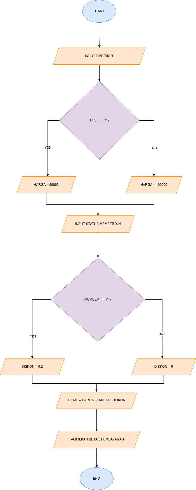

# *Membuat Kode Program dari flowchart pertemuan ke 5*

Tugas Pertemuan Ke 7

Nama: Muhammad aziz tri ramadhan

Kelas: TI 24 A3

NIM: 312410380

## *1. bilanganterbesar.py*



# Langkah-Langkah Program Pemesanan Tiket Bioskop

## A. Persiapan Program
1. Membuat file Python baru dengan nama `tiket_bioskop.py`
2. Menambahkan komentar untuk identifikasi program
3. Membuat tampilan judul program

## B. Langkah Input Data
1. Menampilkan menu pilihan tiket:
   - Reguler: Rp50.000
   - VIP: Rp100.000
2. Meminta input tipe tiket dari user (1/2)
3. Meminta input status member dari user (y/n)

## C. Langkah Proses Data
1. Menentukan harga tiket menggunakan if else:
   ```python
   if tipe == "1":
       harga = 50000
   else:
       harga = 100000
   ```

2. Menentukan diskon menggunakan operator ternary:
   ```python
   diskon = 0.2 if member == "y" else 0
   ```

3. Menghitung total pembayaran:
   ```python
   if member == "y":
       total = harga - (harga * diskon)
   else:
       total = harga
   ```

## D. Langkah Output Data
1. Menampilkan detail pembayaran:
   ```python
   print("\nDetail Pembayaran:")
   print(f"Tipe Tiket: {'Reguler' if tipe == '1' else 'VIP'}")
   print(f"Status Member: {'Ya' if member == 'y' else 'Tidak'}")
   print(f"Harga Tiket: Rp{harga}")
   print(f"Diskon: {int(diskon * 100)}%")
   print(f"Total Bayar: Rp{int(total)}")
   ```

## E. Algoritma Program
1. Mulai program
2. Tampilkan menu pilihan tiket
3. Input pilihan tipe tiket (1/2)
4. Input status member (y/n)
5. IF tipe == "1" THEN
   - harga = 50000
   ELSE
   - harga = 100000
   ENDIF
6. diskon = 0.2 if member == "y" else 0
7. IF member == "y" THEN
   - total = harga - (harga * diskon)
   ELSE
   - total = harga
   ENDIF
8. Tampilkan detail pembayaran
9. Selesai

## F. Cara Menjalankan Program
1. Buka terminal atau command prompt
2. Navigasi ke direktori file program
3. Jalankan perintah: `python tiket_bioskop.py`
4. Ikuti instruksi yang muncul di layar

## G. Contoh Penggunaan
1. Input:
   - Pilih tiket: 2 (VIP)
   - Status member: y (Ya)

2. Output:
   ```
   Detail Pembayaran:
   Tipe Tiket: VIP
   Status Member: Ya
   Harga Tiket: Rp100000
   Diskon: 20%
   Total Bayar: Rp80000
   ```

## H. Penjelasan Komponen Program
1. If else statement:
   - Digunakan untuk menentukan harga berdasarkan tipe tiket
   - Digunakan untuk menghitung total dengan diskon

2. Operator ternary:
   - Digunakan untuk menentukan nilai diskon
   - Digunakan untuk menampilkan string status

## I. Tips Pengembangan
1. Tambahkan validasi input
2. Tambahkan fitur jumlah tiket
3. Tambahkan database member
4. Tambahkan sistem pembayaran
5. Tambahkan cetak tiket

## J. Penanganan Error
1. Input tipe tiket tidak valid
2. Input status member tidak valid
3. Format input tidak sesuai

## K. Pengujian Program
1. Test Case 1: Tiket Reguler Non-Member
2. Test Case 2: Tiket Reguler Member
3. Test Case 3: Tiket VIP Non-Member
4. Test Case 4: Tiket VIP Member

## L. Pemeliharaan Program
1. Backup kode program
2. Update harga tiket jika ada perubahan
3. Update persentase diskon jika ada perubahan
4. Dokumentasi perubahan program

## *2. bilanganN.py*

Program Kedua adalah untuk membandingkan bilangan yang di Input, input akan terus berjalan kecuali user memasukkan nilai 0

*Flowchartnya*


*Program akan meminta kita untuk memasukkan angka untuk dibandingkan, `input akan terus diminta sebelum user memasukkan angka 0 :*


*Penjelasan Code*


def find_largest_number():


Mendefinisikan fungsi bernama find_largest_number yang akan menangani logika utama program.


    largest = float('-inf')  # Inisialisasi dengan nilai negatif tak terhingga


Menginisialisasi variabel largest dengan nilai negatif tak terhingga. Ini memastikan bahwa angka pertama yang dimasukkan akan selalu lebih besar.

\*Maksud dari -infinity(Negatif tak hingga) adalah nilai negatif berapapun.


    count = 0


Menginisialisasi variabel count untuk menghitung jumlah bilangan yang dimasukkan.


    while True:


Memulai loop tak terbatas. Akan terus berjalan sampai dihentikan oleh break.


        num = float(input(f"Masukkan bilangan ke-{count + 1} (atau 0 untuk selesai): "))


Meminta input dari pengguna, mengkonversinya ke float, dan menyimpannya dalam variabel num.


if num == 0:
            break


Jika input adalah 0, keluar dari loop.


count += 1


Menambah penghitung jumlah bilangan yang dimasukkan.


if num > largest:
            largest = num


Jika bilangan yang baru dimasukkan lebih besar dari largest saat ini, update largest.


return largest, count


Setelah loop selesai, kembalikan bilangan terbesar dan jumlah input.


print("Program untuk menentukan bilangan terbesar dari N bilangan")
print("Masukkan angka 0 untuk mengakhiri input\n")


Mencetak instruksi untuk pengguna.


largest, count = find_largest_number()


Memanggil fungsi find_largest_number() dan menyimpan hasilnya.


if count > 0:


Memeriksa apakah ada bilangan yang dimasukkan.


print(f"\nJumlah bilangan yang dimasukkan: {count}")
    print(f"Bilangan terbesar adalah: {largest}")


Jika ada bilangan yang dimasukkan, cetak jumlah input dan bilangan terbesar.


else:
    print("\nTidak ada bilangan yang dimasukkan.")


Jika tidak ada bilangan yang dimasukkan (pengguna langsung memasukkan 0), program akan dijalankan dan menampilkan output perbandingan.